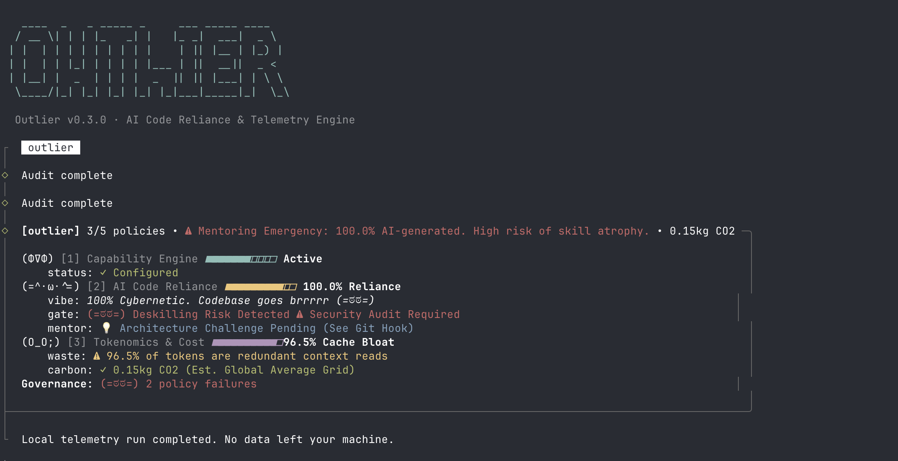

<div align="center">
  
  <h1>outlier</h1>
  <p><b>The Governance & Policy Engine for AI Engineering</b></p>
  <p><i>Measure AI adoption. Enforce Zero-Trust. Protect Human Mastery.</i></p>
  
  <p>
    
    
    
    
  </p>

  <p>
    <b>Get Started Instantly:</b><br/>
    <code>npx @rosh100yx/outlier status</code>
  </p>

  <br/>
  
  <br/>
</div>

`outlier` is an open-source, local-first policy engine and governance framework designed to measure the true cost and risk of AI code generation. As teams accelerate with LLM agents (Cursor, Copilot, Claude Code), `outlier` acts as the definitive **Bouncer**—auditing AI authorship, mitigating deskilling risks, and tracking regional carbon footprints entirely locally. 

**Our Moat:**
1. **Zero-Trust & Local-First:** No API keys, no telemetry sent to the cloud. `outlier` reads your native `~/.claude/` session logs and `.git/` history directly on your machine.
2. **Actionable Policy Engine:** We don't just build dashboards. `outlier` lives in your terminal and CI/CD pipelines (via pre-commit hooks and GitHub Actions), physically blocking risky or overly AI-reliant commits.
3. **Counterfactual Carbon Accounting:** The only observability tool mapping token cache waste directly to your local energy grid (e.g., Global South vs EU), proving true environmental impacts.
4. **Anti-Deskilling Guardrails:** Built to prevent developers from becoming mere spectators in their own codebase.

> *"In a room full of agents" shifts the perspective. It acknowledges that the developer is no longer a solo coder; they are a manager of bots. The product exists to make sure the human doesn't get lazy while managing them. We all want our time back, but we don't want to lose control of the craft.*

<div align="center">
  
</div>

## How It Works
```text
┌───────────┐   ┌────────────┐   ┌───────────┐   ┌─────────────┐
│ AI CODING │──▸│ GIT COMMIT │──▸│  BOUNCER  │──▸│ AUDIT TRACE │
└───────────┘   └────────────┘   └───────────┘   └─────────────┘
                                       │ (Fails)
                                 ┌───────────┐
                                 │ MENTORING │
                                 └───────────┘
```
**Step 1:** Developer delegates code generation to an AI agent (Claude Code, Cursor).  
**Step 2:** Developer attempts to merge code into the main branch.  
**Step 3:** The `outlier` Bouncer hook triggers. If AI reliance > 70%, the commit is physically blocked.  
**Step 4:** A "Mentoring Emergency" is triggered, forcing the developer to solve an architectural challenge to prove mastery and prevent deskilling.  

## What Outlier Adds
`outlier` builds a coordination layer on top of native agent workflows.

| Capability | Ungoverned AI | Outlier Governed |
|------------|---------------|------------------|
| **Deskilling** | Silent skill atrophy | JIT Mentoring Triggers on high-reliance |
| **Commit Gate**| Accepts hallucinated code | Physically blocks code over AI-thresholds |
| **Context** | Blind token spend | Detects "Cache Bloat" and context waste |
| **Security** | Opaque MCP access | Maps and audits active skills/capabilities |

## Commands
| Command | Purpose |
|---------|---------|
| `outlier audit` | Run the standard telemetry dashboard (Cats + Vibes + Metrics) |
| `outlier audit --strict` | Run the dashboard without the Cats/Vibes (Enterprise Dry Mode) |
| `outlier policy` | Interactively select and install the Git Pre-Commit Hook (Bouncer) |
| `outlier capabilities` | Audit your workspace for active MCP servers and Open Session Skills |

## Quickstart: Your First Audit

**Prerequisites:** You need Node/Bun installed and to be inside a Git repository.

1. **Set the Trap (Install the Bouncer)**
   ```bash
   npx @rosh100yx/outlier policy
   ```
   *Select the "Team (70% Max AI)" tier.*

2. **Trigger the Bouncer**
   Write a massive feature using 100% AI. Attempt to commit it:
   ```bash
   git commit -am "added massive ai feature"
   ```
   *Watch the Bouncer block your commit for deskilling risk.*

3. **Measure the Damage**
   ```bash
   npx @rosh100yx/outlier audit
   ```
   *See your exact AI Authorship ratio and Token Waste.*

## Theoretical Foundations
`outlier` is the live, technical implementation of an academic thesis on the thermodynamics of AI code generation and digital sovereignty. 
- **The Geographic Tax:** Western tech companies ship highly compute-intensive AI tools globally, but local infrastructure in the Global South is forced to absorb the carbon cost. `outlier` proves this by weighting session carbon by regional grid intensity (e.g., proving identical work imports 31x more carbon in Vietnam than France).
- **Disempowerment:** Incremental AI substitution erodes human influence. `outlier` acts as a sovereignty shield against opaque AI platforms.
- **Deskilling:** Delegating operators lose supervisory skills. By parsing `Co-Authored-By` Git trailers, `outlier` tracks AI reliance per-individual and flags high reliance as a "Deskilling Risk", triggering mandatory mentoring checkpoints.

## FAQ

**Does this send my code or prompts to the cloud?**  
No. `outlier` is a zero-trust, local-first engine. It parses `git log` and local JSONL token logs. Your code and token usage never leave your machine.

**Do I need to be using a specific IDE?**  
`outlier` is IDE-agnostic. It works by parsing standard `Co-Authored-By` Git trailers, meaning it supports Claude Code, Cursor, Aider, and manual generation.

**Can I run this in CI/CD like GitHub Actions?**  
Yes. Use the `--strict` flag (`npx @rosh100yx/outlier audit --strict`) to return standard zero-exit-code parsing for headless CI environments.

## Who is this for?

If you hold one of these roles, `outlier` was built specifically for you. Please help us improve the framework by running an audit and sharing your terminal screenshot on X.com or your favorite developer community!

- **Engineering Managers & CTOs:** Stop flying blind. Measure true AI adoption, enforce zero-trust security on your IP, and cut your API token bloat.
- **Principal & Staff Engineers:** Protect the craft. Use the Bouncer hook to enforce architectural standards and prevent your team from deskilling.
- **Developers & "Vibe Coders":** Prove your mastery. Run the audit, check your vibe, and post your "Artisan" or "Centaur" terminal status to the community.

## Support the Thesis & Collaborate
This tool is the technical implementation of an ongoing academic thesis on the thermodynamics of AI code generation, skill atrophy, and digital sovereignty. We are actively looking for collaborators, researchers, and engineers to expand this framework.

**Call for Research Data:** We are actively collecting metrics to prove the "Geographic Tax" and measure industry-wide skill atrophy for our upcoming paper. If you use this tool, please share your terminal screenshot (`outlier audit`) on X.com (tagging the maintainers). By sharing your baseline **AI reliance %** and **carbon estimate**, you provide the exact empirical data we need to map how AI is impacting global engineering teams.

See our [Contributing Guide](CONTRIBUTING.md) to get started. Great first issues include adding new regional grid factors to `data/grid-factors.json` or writing custom CI/CD pipeline integrations.

## License
MIT License
